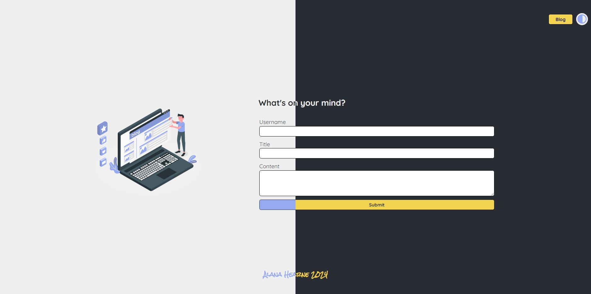
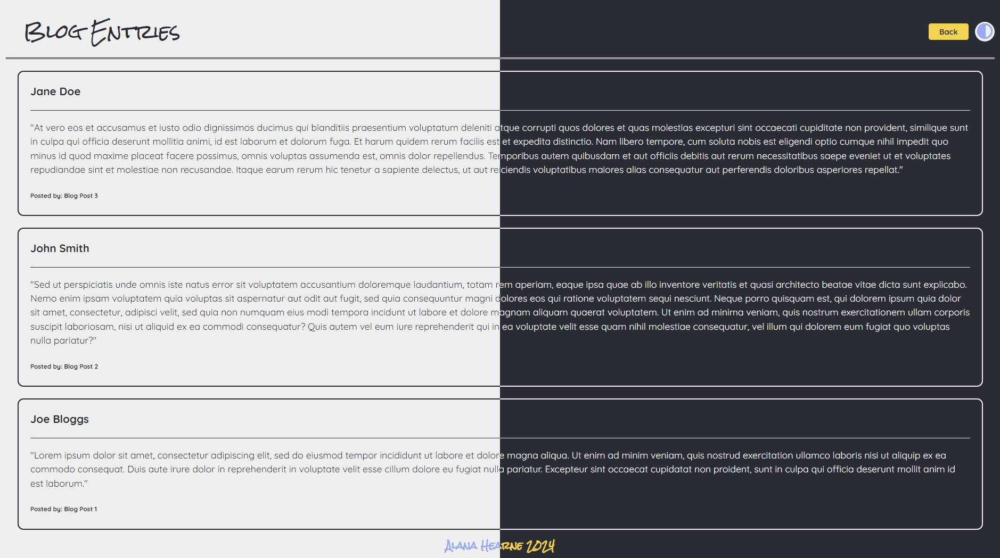

# personal-blog
04-Web-APIs/02-Challenge - Personal blog using HTML/CSS/JavaScript

## Description

Module 4 - Web APIs: Personal Blog Website

Development of HTML, CSS and JavaScript to create a multi-page personal blog, through the execution of the following:

- fillable form and clickable form submit
- storage of form data into local storage for multi-post rendering
- clickable theme toggle to switch from dark/light themes, with chosen theme save in local storage
- creating a unique post for each blog entry
- ensuring data input is not left blank
- handling of blog page if no posts to display
- addition of comments to improve readability

Project executed in accordance with the following challenge requirements:

### User Story

```md
AS A marketing student,
I WANT a personal blog
SO THAT I can showcase my thoughts and experiences.
```

### Acceptance Criteria

```md
GIVEN a personal blog
WHEN I load the app,
THEN I am presented with the landing page containing a form with labels and inputs for username, blog title, and blog content.
WHEN I submit the form,
THEN blog post data is stored to localStorage.
WHEN the form submits,
THEN I am redirected to the posts page.
WHEN I enter try to submit a form without a username, title, or content,
THEN I am presented with a message that prompts me to complete the form.
WHEN I view the posts page,
THEN I am presented with a header, with a light mode/dark mode toggle, and a "Back" button.
WHEN I click the light mode/dark mode toggle,
THEN the page content's styles update to reflect the selection.
WHEN I click the "Back" button,
THEN I am redirected back to the landing page where I can input more blog entries.
WHEN I view the main content,
THEN I am presented with a list of blog posts that are pulled from localStorage.
WHEN I view localStorage,
THEN I am presented with a JSON array of blog post objects, each including the post author's username, title of the post, and post's content.
WHEN I take a closer look at a single blog entry in the list,
THEN I can see the title, the content, and the author of the post.
WHEN I view the footer,
THEN I am presented with a link to the developer's portfolio.
```

## Table of Contents

- [Installation](#installation)
- [Usage](#usage)
- [Credits](#credits)
- [License](#license)

## Installation

Git and an IDE (VSCode recommended) are required to be installed on your computer to clone and view the code for this web application.

From your command line:

```md
### Clone this repository
$ git clone git@github.com:ajhearne-mZAOSW/personal-blog.git

### Navigate into the repository
$ cd personal-blog

### Open in IDE
$ code .
```

## Usage

The following image shows the web application's appearance and functionality:





The web application is depoloyed using GitHub Pages: (<https://ajhearne-mzaosw.github.io/personal-blog/>).

## Credits

- Source starter code provided by University of Sydney, USYD-VIRT-FSF-PT-05-2024-U-LOLC/04-Web-APIs/02-Challenge/Develop
- Fonts from Google Fonts (https://fonts.google.com/)
- Icons from Font Awesome (https://fontawesome.com/icons)
- Images from storyset (https://storyset.com/)

## License

MIT
